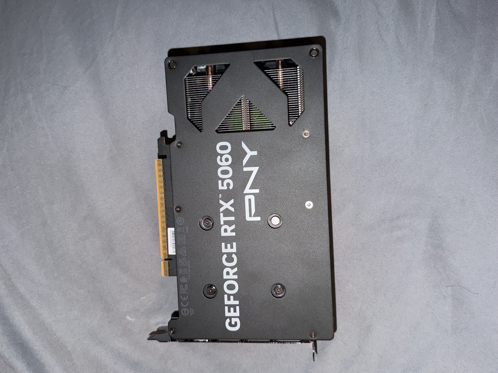
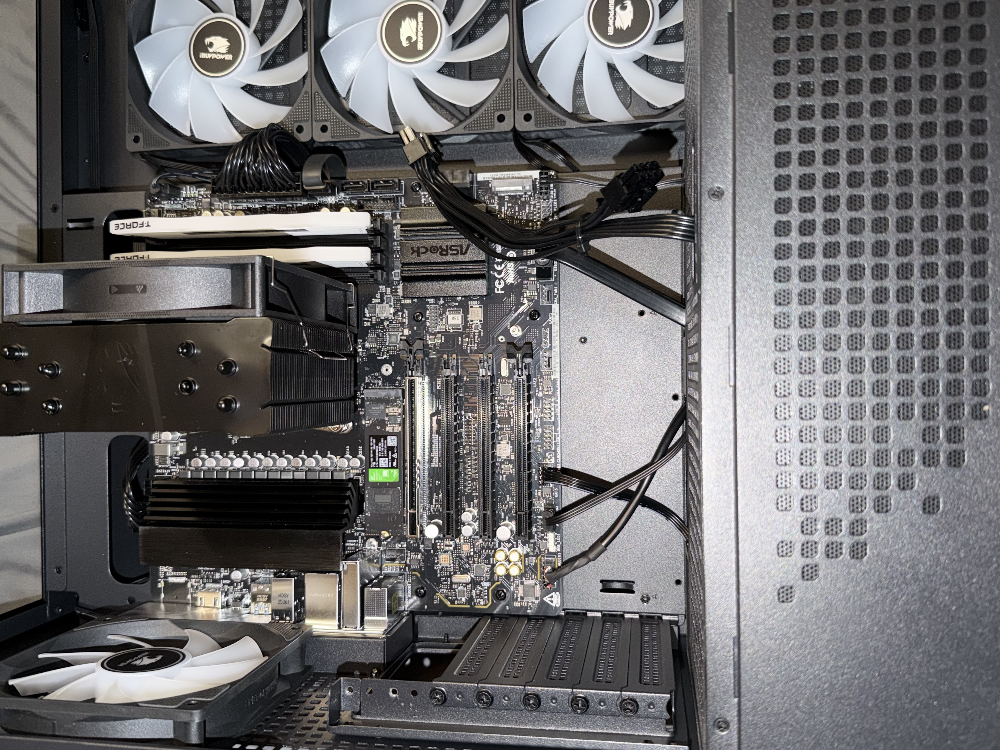
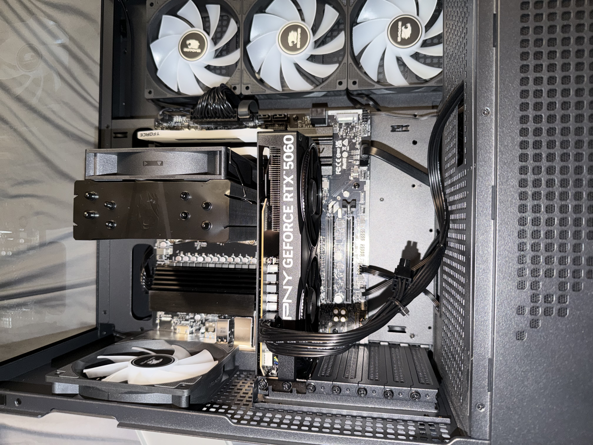
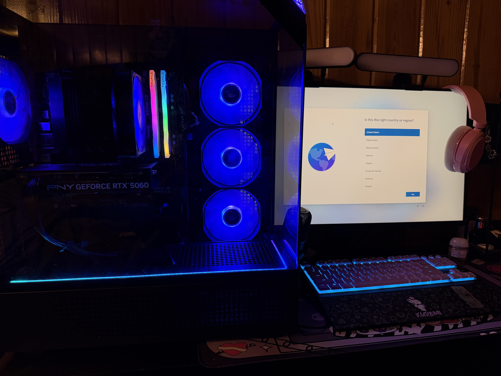

# PC GPU Installation – NVIDIA GeForce RTX 5060

## Project Overview

Upgraded my desktop PC by installing a dedicated PNY GeForce RTX 5060 graphics card. This project involved identifying the appropriate PCIe slot, preparing the chassis for installation, seating and securing the GPU, connecting dedicated PCIe power, and verifying a successful system boot and video output.

## Hardware

- PNY GeForce RTX 5060
- PCIe x16 motherboard
- 8-pin PCIe GPU power connection
- Desktop PC chassis

## GPU Preparation

Before installation, I inspected the graphics card and identified the PCIe edge connector, rear I/O bracket, and required 8-pin PCIe power connection.

## PCIe Slot Identification

I identified the motherboard's primary PCIe x16 slot and the corresponding rear expansion slots in the chassis. The PCIe retention latch was opened before installing the graphics card.

## GPU Installation

The RTX 5060 was aligned with the PCIe x16 slot and carefully seated into the motherboard. I verified that the PCIe retention mechanism engaged and secured the GPU's rear mounting bracket to the chassis.

The GPU was then connected to the power supply using the required 8-pin PCIe power connection.

## System Boot & Verification

After completing the hardware installation, I powered on the system and confirmed a successful boot. The system produced video output with the monitor connected through the newly installed graphics card.

## Skills Demonstrated

- Desktop PC hardware installation
- PCIe expansion card installation
- GPU power cabling
- Hardware identification
- Chassis expansion-slot management
- Hardware troubleshooting and verification
- Safe handling of internal PC components
